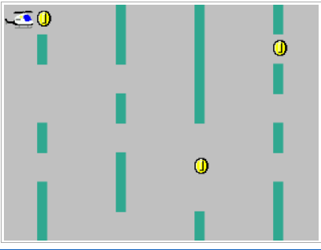

# DE1_SoC_GameProject
Here is the code of running airplane game project. 

## Description
We are trying to make an interesting game called “Moving Plane” for this project. The purpose of the game is to control the plane up and down to avoid coming walls. Users can collect 1 point by passing through the wall each time. Besides, the plane will be changed if the users hit the coin. the colour of the wall will be changed whenever the user is collecting 10 points. If the plane hits the wall, the game is over, and the user can press any KEY to start again. Below lists more detail of operating the "Moving Plane" game.

## Technical  Platform

> This code is suitable for working on to DE1_SoC Board as well as CPUlater (https://cpulator.01xz.net/?sys=arm-de1soc). Since the code is written by C code, please make sure to use C language IDE.

#### HEX & LED lighting
* Level difficulties are showing on HEX0-1, and the scores are shown on 
  HEX3-5. 
*  LED9 indicates the pausing status. When it is on, the game is pause until the users press KEY0 or KEY.
* LED0-1 are the value of indicating the speed difficulty, it control by users pressing switch0-1. 

#### Users Control
* Players can press KEY0 to move the plane up and press KEY1 to move the plane down. 
* KEY0 or KEY1 should press twice, otherwise, it will consider as a pause, and LED9 will highlight.

#### Speed Control

* Players can control the speed of the wall manually by pushing switch 0 
and 1, and they can also return to normal speed at any time when they 
are pressing those switches. LED0-1 are the value of indicating the 
player is pressing the switches. 

* The walls speed up and change colors when the player collects every 
10 points, and each point corresponding with the times of passing the 
wall. 

#### Coin Event

<figure class="third">
    
    
    
</figure>

* The aircraft can be upgraded if the player is successfully collecting the 
  coin during the game. 
*  There are 3 status of plane, and it will iterating to change the plane after collecting numerous coins.

#### Game Over

* END image will appear into screen  
* If the aircraft is hit the wall, then game over. All scores and level difficulties will start at 0.
* Players can press any KEY to start again.

